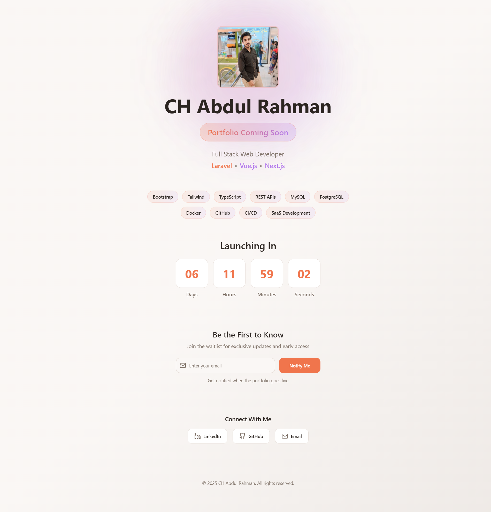

# Coming Soon Landing Page



## 🚀 Quick Start

This is a production-ready "Coming Soon" landing page built with React, TypeScript, and Vite.

### Prerequisites
- Node.js 18+ and npm/yarn installed
- A domain name (optional, for custom domain)

## 📝 Configuration

### 1. Set Launch Date
Set the launch date in your `.env` file using `VITE_LAUNCH_DATE` (ISO 8601 recommended):
```env
VITE_LAUNCH_DATE="2025-12-31T00:00:00Z"
```
The countdown in `src/components/CountdownTimer.tsx` reads this automatically. You can still override by passing a `launchDate` prop if needed.

### 2. Update Contact Links
Configure your social links via `.env` (no code changes required):
```env
VITE_LINKEDIN_USERNAME="your-linkedin"
VITE_GITHUB_USERNAME="your-github"
VITE_CONTACT_EMAIL="you@example.com"
```
`src/components/ContactLinks.tsx` builds the URLs from these values.

### 3. Configure Email Subscription

The subscription form in `src/components/SubscribeForm.tsx` is integrated with ConvertKit and uses env configuration. You can switch to alternative providers if you prefer.

1. Sign up at [convertkit.com](https://convertkit.com)
2. Create a Form and note the Form ID
3. Get your API key from Account Settings
4. Set these in `.env`:
```env
VITE_CONVERTKIT_FORM_ID="your-form-id"    # your form id
VITE_CONVERTKIT_API_KEY="your-api-key" # your API key
```
`SubscribeForm.tsx` will POST to ConvertKit using URL-encoded form data:
```ts
await fetch(`https://api.convertkit.com/v3/forms/${import.meta.env.VITE_CONVERTKIT_FORM_ID}/subscribe`, {
  method: 'POST',
  headers: { 'Content-Type': 'application/x-www-form-urlencoded' },
  body: new URLSearchParams({
    api_key: import.meta.env.VITE_CONVERTKIT_API_KEY,
    email,
  }),
});
```
Note: API keys in Vite are exposed client-side. For stricter security, proxy this call via a serverless function.

### 4. Update SEO Meta Tags

Edit `index.html` to customize:
- Title
- Description
- Open Graph image (create an `og-image.jpg` in `public/`)
- Twitter card image
- Canonical URL

## 🏗️ Local Development

```bash
# Install dependencies
npm install

# Run development server
npm run dev

# Build for production
npm run build

# Preview production build
npm run preview
```

Note: After changing `.env`, restart the dev server so Vite reloads environment variables.

## 🌐 Deployment Options

### Option 1: Vercel (Recommended)

1. Push your code to GitHub
2. Visit [vercel.com](https://vercel.com)
3. Import your repository
4. Deploy! (Vercel auto-detects Vite)

Custom domain setup:
- Go to Project Settings → Domains
- Add your domain and follow DNS instructions

### Option 2: Netlify

1. Push code to GitHub
2. Visit [netlify.com](https://netlify.com)
3. New site from Git → Select your repo
4. Build settings:
   - Build command: `npm run build`
   - Publish directory: `dist`
5. Deploy!

Custom domain:
- Go to Domain Settings → Add custom domain

### Option 3: GitHub Pages

1. Install gh-pages:
```bash
npm install --save-dev gh-pages
```

2. Add to `package.json`:
```json
{
  "scripts": {
    "predeploy": "npm run build",
    "deploy": "gh-pages -d dist"
  },
  "homepage": "https://yourusername.github.io/your-repo-name"
}
```

3. Update `vite.config.ts`:
```typescript
export default defineConfig({
  base: '/your-repo-name/',
  // ... other config
})
```

4. Deploy:
```bash
npm run deploy
```

### Option 4: Traditional Hosting (cPanel, etc.)

1. Build the project:
```bash
npm run build
```

2. Upload the contents of the `dist/` folder to your web host's public directory (e.g., `public_html/`)

3. Ensure your domain points to the upload directory

## 🎨 Customization

### Colors & Theme
Edit `src/index.css` to change the color scheme:
```css
:root {
  --primary: 15 85% 62%;        /* Warm coral */
  --secondary: 270 75% 70%;     /* Purple accent */
  --background: 25 35% 97%;     /* Cream background */
  /* ... more colors */
}
```

### Fonts
The page uses Inter font from Google Fonts. To change:
1. Add font link in `index.html`
2. Update CSS in `src/index.css`

### Skills
Edit `src/components/SkillsBadges.tsx`:
```typescript
const skills = ['Your', 'Skills', 'Here'];
```

## 📊 Analytics (Optional)

### Google Analytics

Add to `index.html` before closing `</head>`:
```html
<!-- Google tag (gtag.js) -->
<script async src="https://www.googletagmanager.com/gtag/js?id=G-XXXXXXXXXX"></script>
<script>
  window.dataLayer = window.dataLayer || [];
  function gtag(){dataLayer.push(arguments);}
  gtag('js', new Date());
  gtag('config', 'G-XXXXXXXXXX');
</script>
```

## 🔒 Environment Variables

Create a `.env` file in the project root. Available variables:
```env
# Countdown
VITE_LAUNCH_DATE="2025-12-31T00:00:00Z"     # ISO 8601 recommended

# Contact Links
VITE_LINKEDIN_USERNAME="your-linkedin"
VITE_GITHUB_USERNAME="your-github"
VITE_CONTACT_EMAIL="you@example.com"

# ConvertKit (subscription)
VITE_CONVERTKIT_FORM_ID="your-form-id"
VITE_CONVERTKIT_API_KEY="your-api-key"
```

Access in code (Vite):
```ts
const launchDate = import.meta.env.VITE_LAUNCH_DATE;
```

## 🐛 Troubleshooting

**Issue: Form not submitting**
- Check browser console for errors
- Verify CORS settings if using external API
- Test API endpoint directly with curl/Postman

**Issue: Countdown not working**
- Ensure `VITE_LAUNCH_DATE` is a valid date string. Prefer ISO format like `2025-12-31T00:00:00Z`.
- After editing `.env`, restart the dev server.
- Check browser timezone handling if using non-UTC times.

**Issue: Build fails**
- Clear node_modules: `rm -rf node_modules && npm install`
- Check Node version: `node -v` (needs 18+)

## 📱 Performance Tips

1. Add proper image optimization (use WebP format)
2. Enable compression on your hosting
3. Consider adding a CDN for static assets
4. Monitor with Lighthouse

## 📄 License

This project is open source and available for personal and commercial use.

## 🆘 Support

For issues or questions:
- Check the browser console for errors
- Review the email service provider's documentation
- Ensure all dependencies are installed correctly

---

**Need help?** The code is well-commented and follows React best practices. Each component is self-contained and easy to modify.